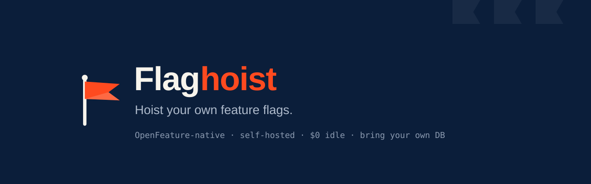
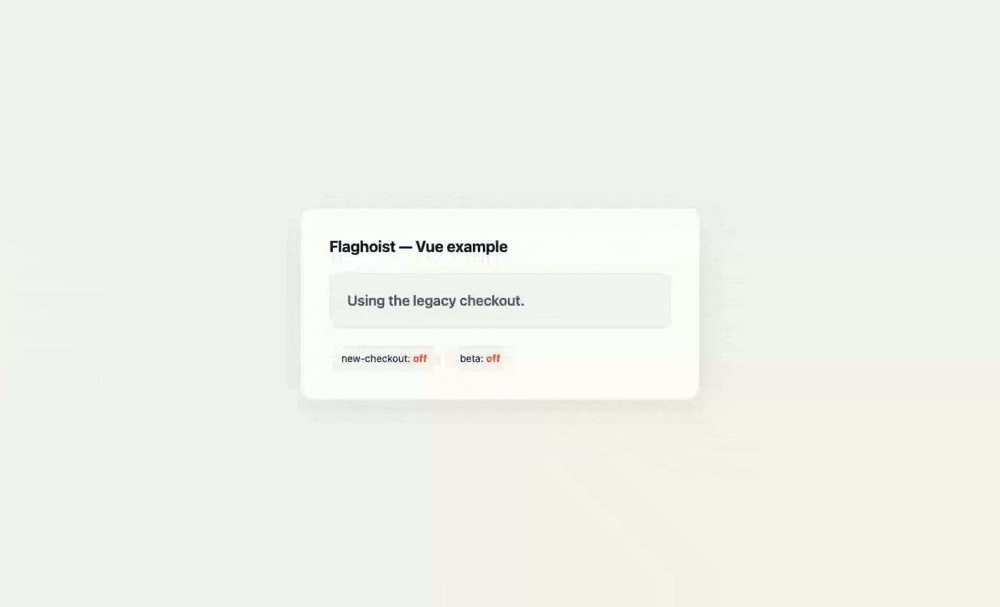

<p align="center">
  
</p>

<p align="center">
  <strong>Feature flags at the edge. No server, no database, no bill.</strong><br />
  Self-host your own flag service in five minutes — and use it from every language
  with an OpenFeature SDK, on day one.
</p>

<p align="center">
  <a href="https://github.com/flaghoist/flaghoist/blob/main/LICENSE"></a>
  <a href="https://github.com/flaghoist/flaghoist/actions/workflows/ci.yml"></a>
  <a href="https://openfeature.dev"></a>
  
</p>

<!--
  DEMO GIF GOES HERE — the highest-leverage asset in this README.
  Record: flaghoist deploy → create a flag → toggle it in the dashboard → the app flips.
  Keep it under 20 seconds. Then uncomment:

<p align="center">
  
</p>
-->

---

> **Status: pre-alpha, under active construction.** APIs will change without notice until 0.1.0. Stars
> and early feedback are hugely welcome; production use is not recommended yet.

## What is Flaghoist?

Flaghoist is a feature-flag service you **own**. It runs on your infrastructure (Cloudflare Workers by
default, or any Node/Bun/Deno runtime), stores flags in **any fast database you point it at** (Workers
KV by default), and speaks the **OpenFeature Remote Evaluation Protocol (OFREP)** — so every language
with an OpenFeature provider works with it on day one, without Flaghoist writing a single per-language
SDK.

- **$0 idle** — scale-to-zero on the Cloudflare free tier. No always-on server, no database bill.
- **OpenFeature-native** — standard SDKs everywhere; swap Flaghoist for LaunchDarkly/Datadog with one provider line.
- **Bring your own DB** — a storage adapter is four methods (`get`/`put`/`delete`/`list`). KV, Redis, DynamoDB, Postgres, or your own.
- **Targeting from day one** — boolean flags, sticky percentage rollouts, and ordered targeting rules.
- **A dashboard in the box** — a single deploy gives you the read API, the admin API, and a management UI.

## Why not just use X?

An honest table — including the rows where Flaghoist loses today.

|                    | LaunchDarkly    | Flagsmith / Unleash   | PostHog             | flagd              | **Flaghoist**                   |
| ------------------ | --------------- | --------------------- | ------------------- | ------------------ | ------------------------------- |
| Deployment         | SaaS            | Server + Postgres     | SaaS or server + DB | Sidecar per pod    | **Serverless, or any runtime**  |
| Idle cost          | Subscription    | Always-on server + DB | Free tier, then $$  | A sidecar per pod  | **$0 (scale-to-zero)**          |
| Management UI      | Yes             | Yes                   | Yes                 | No                 | **Yes, self-hosted**            |
| Protocol           | Proprietary SDK | OF providers          | Own SDK             | OpenFeature-native | **OpenFeature + OFREP native**  |
| Your data lives    | Their cloud     | Your DB               | Their cloud         | Files              | **Your DB, your account**       |
| Multivariate flags | Yes             | Yes                   | Yes                 | Yes                | _Not yet — boolean only_        |
| Experiments / A-B  | Yes             | Yes                   | Yes                 | No                 | _No (bring your own analytics)_ |
| Maturity           | Mature          | Mature                | Mature              | CNCF               | _Pre-alpha, one maintainer_     |

**Why not just build it yourself?** You can — a JSON blob in S3 gets you 60% of the way. The other
40% is what's here: sticky SHA-256 rollouts that don't reshuffle users on every deploy, ordered
targeting rules, OFREP conformance so every OpenFeature SDK works unmodified, an audit trail, and
a UI your PM can use without a deploy.

## Quickstart

```bash
# 1. Stand up your own flag service (once, for your whole team)
mkdir team-flags && cd team-flags
npx flaghoist init --name team-flags     # writes flaghoist.toml — the entire project
npx flaghoist deploy                     # → https://team-flags.<you>.workers.dev
```

Your API, your dashboard at `/admin`, and your storage — one deploy, no code. Want the code
instead? `npx flaghoist eject` turns it into a one-file TypeScript project you own.

```bash
# 2. In your app, install the client
npm install @openfeature/web-sdk @flaghoist/vue
```

```ts
// 3. Wire the provider once, at startup
import { OpenFeature } from '@openfeature/web-sdk'
import { FlaghoistProvider } from '@flaghoist/vue'

await OpenFeature.setProviderAndWait(
  new FlaghoistProvider({
    url: import.meta.env.VITE_FLAGS_URL,
    apiKey: import.meta.env.VITE_FLAGS_KEY,
  }),
)
```

```vue
<!-- 4. Use it anywhere -->
<script setup lang="ts">
import { useFeatureFlag } from '@flaghoist/vue'
const newCheckout = useFeatureFlag('new-checkout')
</script>

<template>
  <NewCheckout v-if="newCheckout" />
  <LegacyCheckout v-else />
</template>
```

Full docs: **[docs.flaghoist.dev](https://docs.flaghoist.dev)** _(coming soon)_.

## Monorepo layout

```
packages/
  core/                 @flaghoist/core — schema, evaluation engine, interfaces (zero deps)
  server/               @flaghoist/server — Hono app: OFREP + admin CRUD + dashboard
  adapters/
    memory/             @flaghoist/adapter-memory — dev/test/fallback
    cloudflare-kv/      @flaghoist/adapter-cloudflare-kv — default storage
    redis/              @flaghoist/adapter-redis — ioredis (Node) or Upstash (edge)
    postgres/           @flaghoist/adapter-postgres — jsonb table via node-postgres
  adapter-conformance/  @flaghoist/adapter-conformance — the shared test suite every
                        adapter must pass, so BYO storage is verified, not just promised
  providers/
    web/                @flaghoist/provider-web — OpenFeature web SDK provider
    node/               @flaghoist/provider-node — OpenFeature server SDK provider
  vue/                  @flaghoist/vue — useFeatureFlag() composable
  cli/                  flaghoist — scaffold, deploy, and manage flags
apps/                   dashboard (Vue), web + docs (Astro)
examples/               vue, node, worker
```

## Development

```bash
corepack enable
pnpm install
pnpm build         # build all packages
pnpm test          # run all tests
pnpm typecheck     # type-check all packages
```

## Project status & sustainability

Flaghoist is currently built and maintained by one person. That's a fair thing to weigh before
adopting any piece of infrastructure, so here is exactly what it means for you:

- **Apache-2.0.** Anyone can fork it and keep it alive. No CLA, no rug-pull clause.
- **Your flags live in your storage** — your KV namespace, your Redis, your Postgres. Nothing about
  this project's health affects your data.
- **The API is [OFREP](https://openfeature.dev/specification/appendix-c), an open standard.** If you
  ever want to leave, point the same OpenFeature providers at a different server. No app rewrite.
- **`flaghoist eject`** hands you a self-contained TypeScript project you own outright.

If this project stalled tomorrow, you would keep running exactly what you are running today. That
is deliberate — it's the whole point of self-hosting on open protocols.

Want to shrink the bus factor? New storage adapters are self-contained, need ~four methods, and are
validated by an existing conformance suite — see the `good first issue` label.

## Contributing

Flaghoist is Apache-2.0 and community-driven. New storage adapters and OFREP language guides are
excellent first contributions — see [CONTRIBUTING.md](./CONTRIBUTING.md) and our
[Code of Conduct](./CODE_OF_CONDUCT.md).

## License

[Apache-2.0](./LICENSE) © Damilola Oluwafemi and the Flaghoist contributors.

Flaghoist is not affiliated with or endorsed by the OpenFeature project or the CNCF.
